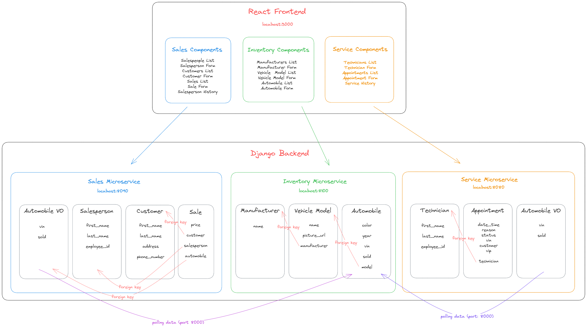

# CarCar

Team:

* Amanda Taing - Services microservice
* Peter Kim - Sales microservice

## Design

CarCar is an application that allows a user to manage aspects of an automobile dealership and includes features to manage inventory, services, and sales.

CarCar is built using microservices that handle each feature for more efficiency, flexibility, and scalability. It also utilizes RESTful APIs to optimize client-server interaction. The frontend is built using React.

## Application Diagram



## Getting Started

### Clone the Repository

1. Fork the repository to your own gitlab
2. Clone the project into the directory of your choice within your terminal using the command: ```https://gitlab.com/peterkim647/project-beta.git```
3. Switch into your cloned project directory using the command: ```cd project-beta```

### Start up Docker

After confirming that the Docker Desktop application is running, run the following commands in your terminal:
1. ```docker volume create beta-data```
2. ```docker-compose build```
3. ```docker-compose up```

This can take a few minutes. Meanwhile, keep an eye on your container logs.
Once you see the message ```docker-compose-wait - Everything's fine, the application can now start!```,
you will be able to see view the application in your browser by typing ```http://localhost:3000```.

## Using the Application Front End

The front-end application is created with React using RESTful APIs from the back end. The application has an easy-to-use navigation bar with drop down links to each feature outlined below.

### Inventory Drop Down

| Feature                   | Link                                      | Description                           |
| ------------------------- | ----------------------------------------- | --------------------------------------|
| Manufacturers             | http://localhost:3000/manufacturers       | Lists all manufacturers inside the database |
| Create a Manufacturer     | http://localhost:3000/manufacturers/new   | A form to input a new manufacturer into the database |
| Vehicle Models            | http://localhost:3000/models              | Lists all vehicle models inside the database |
| Create a Vehicle Model    | http://localhost:3000/models/new          | A form to input a new vehicle model into the database |
| Automobiles               | http://localhost:3000/automobiles         | Lists all automobiles and their information inside the database |
| Create an Automobile      | http://localhost:3000/automobiles/new     | A form to input a new automobile inside the database |

### Sales Drop Down

| Feature                   | Link                                      | Description                           |
| ------------------------- | ----------------------------------------- | --------------------------------------|
| Customers                 | http://localhost:3000/customers          | Lists all customers inside the database |
| Create a Customer         | http://localhost:3000/customers/create    | A form to input a new customer into the database |
| Sales                     | http://localhost:3000/sales               | Lists all sales inside the database |
| Add a Sale                | http://localhost:3000/sales/new           | A form to input a new sale into the database |
| Sales History             | http://localhost:3000/sales/history       | Lists all sales by a specific salesperson |

### Services Drop Down

| Feature                               | Link                                      | Description                           |
| ------------------------------------- | ----------------------------------------- | --------------------------------------|
| Service Appointments                  | http://localhost:3000/apointments        | Lists all appointments that have not been canceled for finished. Appointments can be marked cancelled or finished |
| Create a Service Appointment          | http://localhost:3000/apointments/new     | A form to input a new appointment into the database |
| Service History                       | http://localhost:3000/appointments/history| Lists all of the appointments in the database |

### Employees Drop Down

| Feature                      | Link                                      | Description                           |
| ---------------------------- | ----------------------------------------- | --------------------------------------|
| Technicians                  | http://localhost:3000/technicians         | Lists all technicians in the database |
| Add a Technician             | http://localhost:3000/technicians/new     | A form to input a new technician into the database |
| Salespeople                  | http://localhost:3000/salespeople         | Lists all salespeople in the database |
| Add a Salesperson            | http://localhost:3000/salespeople/create  | A form to input a new salesperson into the database |


## Back End
The back end of this application uses Django to create RESTful APIs in microservices. Below are the RESTful endpoints for each microservice with example inputs and returns.
### Inventory Microservice API

#### Manufacturer

| Action                           | Method       | URL                                     |
| -------------------------------- | ------------ | ----------------------------------------|
| List Manufacturers               | GET          | http://localhost:8100/api/manufacturers/ |
| Create a manufacturer            | POST         | http://localhost:8100/api/manufacturers/ |
| Get a specific manufacturer      | GET          | http://localhost:8100/api/manufacturers/:id/ |
| Update a specific manufacturer   | PUT          | http://localhost:8100/api/manufacturers/:id/ |
| Delete a specific manufacturer   | DELETE       | http://localhost:8100/api/manufacturers/:id/ |

<details>
    <summary markdown="span">POST, PUT: Creating or updating a specific manufacturer requires the following input:</summary>

    {
        "name": "Mazda"
    }
</details>

<details>
<summary markdown="span">GET, POST, PUT: Getting, creating, or updating a single manufacturer returns its href, id, and name:</summary>

    {
        "href": "/api/manufacturers/1/",
        "id": 1,
        "name": "Mazda"
    }
</details>

<details>
<summary markdown="span">GET: Getting the list of manufacturers returns a dictionary with a "manufacturers" key that contains a list of manufacturer objects:</summary>

    {
        "manufacturers": [
            {
                "href": "/api/manufacturers/1/",
                "id": 1,
                "name": "Mazda"
            },
            {
                "href": "/api/manufacturers/2/",
                "id": 2,
                "name": "Suburu"
            }
        ]
    }
</details>

#### Vehicle Models

| Action                           | Method       | URL                                     |
| -------------------------------- | ------------ | ----------------------------------------|
| List vehicle models               | GET          | http://localhost:8100/api/models/ |
| Create a vehicle model            | POST         | http://localhost:8100/api/models/ |
| Get a specific vehicle model      | GET          | http://localhost:8100/api/models/:id/ |
| Update a specific vehicle model   | PUT          | http://localhost:8100/api/models/:id/ |
| Delete a specific vehicle model   | DELETE       | http://localhost:8100/api/models/:id/ |

<details>
    <summary markdown="span">POST: Creating a specific vehicle model requires a name, picture url, and manufacturer id:</summary>

    {
        "name": "CX-30",
        "picture_url": "https://alexonautos.com/wp-content/uploads/2022/07/PXL_20220404_165630760-scaled.jpg",
        "manufacturer_id": 1
    }
</details>

<details>
    <summary markdown="span">PUT: Updating a specific vehicle model requires a name and/or picture url:</summary>

    {
        "name": "CX-30",
        "picture_url": "https://alexonautos.com/wp-content/uploads/2022/07/PXL_20220404_165630760-scaled.jpg"
    }
</details>

<details>
    <summary markdown="span">POST, PUT: Creating or updating a specific vehicle model returns its href, id, name, picture url, and a manufacturer dictionary containing the manufacturer's href, id, and name:</summary>

    {
        "href": "/api/models/1/",
        "id": 1,
        "name": "CX-30",
        "picture_url": "https://alexonautos.com/wp-content/uploads/2022/07/PXL_20220404_165630760-scaled.jpg",
        "manufacturers": {
            "href": "/api/manufacturers/1/",
            "id": 1,
            "name": "Mazda"
    }
</details>

<details>
    <summary markdown="span">GET: Getting the list of vehicle models returns a dictionary with a key "models" that contains a list of model objects:</summary>

    {
        "models": [
            {
                "href": "/api/models/1/",
                "id": 1,
                "name": "CX-30",
                "picture_url": "https://alexonautos.com/wp-content/uploads/2022/07/PXL_20220404_165630760-scaled.jpg",
                "manufacturers": {
                    "href": "/api/manufacturers/1/",
                    "id": 1,
                    "name": "Mazda"
                }
            },
        ]

        }
    }
</details>

<details>
    <summary markdown="span">DELETE: Deleting a specific vehicle model returns the properties of that model with id set to null:</summary>

    {
        "id": null,
        "name": "HR-V",
        "picture_url": "https://65e81151f52e248c552b-fe74cd567ea2f1228f846834bd67571e.ssl.cf1.rackcdn.com/ldm-images/2018-Honda-HR-V-Misty-Green-Pearl.jpg",
        "manufacturer": {
            "href": "/api/manufacturers/6/",
            "id": 6,
            "name": "Honda"
        }
    }
</details>

#### Automobiles
| Action	                    | Method	| URL |
| ----------------------------- | --------- | --- |
| List automobiles	            |   GET	    | http://localhost:8100/api/automobiles/ |
| Create an automobile          |	POST	| http://localhost:8100/api/automobiles/ |
| Get a specific automobile     |	GET	    | http://localhost:8100/api/automobiles/:vin/ |
| Update a specific automobile  |	PUT	    | http://localhost:8100/api/automobiles/:vin/ |
| Delete a specific automobile  |	DELETE	| http://localhost:8100/api/automobiles/:vin/ |

<details>
    <summary markdown="span">POST: Creating a specific automobile requires a color, year, vin, and model id:</summary>

    {
        "color": "red",
        "year": 2012,
        "vin": "1C3CC5FB2AN120174",
        "model_id": 1
    }
</details>

<details>
    <summary markdown="span">PUT: The color, year, and sold status can be updated for a specific automobile:</summary>

    {
        "color": "red",
        "year": 2012,
        "sold": true
    }
</details>

<details>
    <summary markdown="span">GET, POST: Getting or creating a specific automobile returns its automobile, model, and manufacturer information :</summary>

    {
        "href": "/api/automobiles/1C3CC5FB2AN120174/",
        "id": 1,
        "color": "yellow",
        "year": 2013,
        "vin": "1C3CC5FB2AN120174",
        "model": {
            "href": "/api/models/1/",
            "id": 1,
            "name": "Sebring",
            "picture_url": "https://upload.wikimedia.org/wikipedia/commons/thumb/7/71/Chrysler_Sebring_front_20090302.jpg/320px-Chrysler_Sebring_front_20090302.jpg",
            "manufacturer": {
            "href": "/api/manufacturers/1/",
            "id": 1,
            "name": "Daimler-Chrysler"
            }
        },
        "sold": false
    }
</details>

<details>
    <summary markdown="span">GET: Getting the list of automobiles returns a dictionary with the key "autos" set to a list of automobile information:</summary>

    {
        "autos": [
            {
            "href": "/api/automobiles/1C3CC5FB2AN120174/",
            "id": 1,
            "color": "yellow",
            "year": 2013,
            "vin": "1C3CC5FB2AN120174",
            "model": {
                "href": "/api/models/1/",
                "id": 1,
                "name": "Sebring",
                "picture_url": "https://upload.wikimedia.org/wikipedia/commons/thumb/7/71/Chrysler_Sebring_front_20090302.jpg/320px-Chrysler_Sebring_front_20090302.jpg",
                "manufacturer": {
                "href": "/api/manufacturers/1/",
                "id": 1,
                "name": "Daimler-Chrysler"
                }
            },
            "sold": false
            }
        ]
    }
</details>

<details>
    <summary markdown="span">DELETE: Deleting a specific automobile returns the automobile information with id set to null:</summary>

    {
        "href": "/api/automobiles/WBAPK5C5XAA628379/",
        "id": null,
        "color": "red",
        "year": 2023,
        "vin": "WBAPK5C5XAA628379",
        "model": {
            "href": "/api/models/3/",
            "id": 3,
            "name": "MX-5 Miata",
            "picture_url": "https://www.thedrive.com/uploads/2023/06/14/2023MazdaMiata1.jpg?auto=webp&crop=16%3A9&auto=webp&optimize=high&quality=70&width=1440",
            "manufacturer": {
                "href": "/api/manufacturers/1/",
                "id": 1,
                "name": "Mazda"
            }
        },
        "sold": false
    }
</details>

### Service Microservice API

The Service Microservice API has three models:

1. The ```Technician``` model contains ```first_name```, ```last_name```, and ```employee_id``` fields. It stores information about each technician that is created.

2. The ```AutomobileVO``` model contains ```vin``` and ```sold``` fields. This serves as a value object that continuously polls for data from the Automobile model in the Inventory Microservice. The poller function loops over each automobile object and looks for an AutomobileVO object with a matching VIN. If a matching AutomobileVO object is found, it will be updated--if not, it will create a new AutomobileVO object using the data in the provided ```defaults``` dictionary.

3. The ```Appointment``` model contains ```date_time```, ```reason```, ```status```, ```vin```, ```customer```, ```technician```, and ```vip``` fields, with the ```technician``` field being a foreign key. This model stores information about each Appointment that is created. The ```vin``` field is not a foreign key referencing the Inventory Microservice because people who own a car that is not from the inventory should be able to create an appointment. However, if the VIN provided for an appointment does exist within the inventory, that means they were a customer and thus receive a VIP status for special treatment.

#### Technician

| Action	                    | Method	| URL |
| ----------------------------- | --------- | --- |
| List technicians          	| GET	    | http://localhost:8080/api/technicians/ |
| Create a technician       	| POST	    | http://localhost:8080/api/technicians/ |
| Delete a specific technician	| DELETE	| http://localhost:8080/api/technicians/:id/ |

<details>
    <summary markdown="span">GET: Getting list of technicians</summary>
    Returns:

    {
        "technicians": [
            {
                "href": "/api/technicians/1/",
                "id": 1,
                "first_name": "Aaron",
                "last_name": "Carranza",
                "employee_id": "acarranza"
            }
        ]
    }
</details>

<details>
    <summary markdown="span">POST: Creating a specific technician requires a first name, last name, and employee id:</summary>
JSON Body Request:

    {
        "first_name": "John",
        "last_name": "Doe",
        "employee_id": "jdoe"
    }

Returns:

    {
        "href": "/api/technicians/3",
        "id": 3,
        "first_name": "John",
        "last_name": "Doe",
        "employee_id": "jdoe"
    }
</details>

<details>
    <summary markdown="span">DELETE: Deleting a specific technician</summary>
    Returns:

        {
            "deleted": true
        }

</details>

#### Appointment
| Action	                    | Method	| URL |
| ----------------------------- | --------- | --- |
| List appointments	            | GET	    | http://localhost:8080/api/appointments/ |
| Create an appointment	        | POST	    | http://localhost:8080/api/appointments/ |
| Delete an appointment	        | DELETE	| http://localhost:8080/api/appointments/:id/ |
| Set appointment status to "canceled" |	PUT	 | http://localhost:8080/api/appointments/:id/cancel/ |
| Set appointment status to "finished" |	PUT	| http://localhost:8080/api/appointments/:id/finish/ |

<details>
    <summary markdown="span">GET: List appointments</summary>
    Returns

    {
	    "appointments": [
            {
                "id": 35,
                "date_time": "2023-01-24T10:00:00+00:00",
                "reason": "oil change",
                "status": "finished",
                "vin": "1C3CC5FB2AN120174",
                "customer": "Geo",
                "technician": {
                    "href": "/api/technicians/1/",
                    "id": 1,
                    "first_name": "Aaron",
                    "last_name": "Carranza",
                    "employee_id": "acarranza"
                },
                "vip": true
            }
        ]
    }

</details>

<details>
    <summary markdown="span">POST: Create an appointment</summary>
JSON body request:

        {
            "vin": "WBAPK5C5XAA628377",
            "customer": "John",
            "date_time": "2023-08-26T13:00:00",
            "technician": "acarranza",
            "reason": "oil change"
        }

Returns:

        {
            "id": 40,
            "date_time": "2023-08-26T13:00:00",
            "reason": "oil change",
            "status": "created",
            "vin": "WBAPK5C5XAA628377",
            "customer": "John",
            "technician": {
                "href": "/api/technicians/1/",
                "id": 1,
                "first_name": "Aaron",
                "last_name": "Carranza",
                "employee_id": "acarranza"
            },
            "vip": true
        }

</details>

<details>
    <summary markdown="span">DELETE: Delete an appointment</summary>
    Returns

    {
	    "deleted": true
    }

</details>

<details>
    <summary markdown="span">PUT: Updating an appointment's status to canceled or finished</summary>
JSON body request:

    {
	    "status": "canceled"
    }

Returns:

    {
        "id": 35,
        "date_time": "2023-01-24T10:00:00+00:00",
        "reason": "oil change",
        "status": "canceled",
        "vin": "1C3CC5FB2AN120174",
        "customer": "John",
        "technician": {
            "href": "/api/technicians/1",
            "id": 1,
            "first_name": "Aaron",
            "last_name": "Carranza",
            "employee_id": "acarranza"
        },
        "vip": true
    }

</details>

### Sales Microservice API

The Sales Microservice has four models:

1. The ```Salesperson``` model contains ```first_name```, ```last_name```, ```employee_id``` fields. It stores information for each salesperson created.

2. The ```Customer``` model contains ```first_name```, ```last_name```, ```address```, and ```phone_number``` fields. It stores information for each customer created.

3. The ```Sale``` model contains ```automobile```, ```salesperson```, ```customer```, and ```price``` fields. All fields except ```price``` are foreign key fields. The ```automobile``` foreign key references the ```AutomobileVO``` model so that the automobile information will be recorded in the sale. The ```salesperson``` foreign key references the ```Salesperson``` model so that the salesperson who sold the automobile will be recorded in the sale. The ```customer``` foreign key references the ```Customer``` model so that the customer information will be recorded in the sale. All automobiles available for sale must come from the Inventory and be currently unsold.

4. The ```AutomobileVO``` model contains ```vin``` and ```sold``` fields. This serves as a value object that continuously polls for data from the Automobile model in the Inventory Microservice. The poller function loops over each automobile object and looks for an AutomobileVO object with a matching VIN. If a matching AutomobileVO object is found, it will be updated--if not, it will create a new AutomobileVO object using the data in the provided ```defaults``` dictionary.

#### Salesperson

| Action	                    | Method	| URL |
| ----------------------------- | --------- | --- |
| List salespeople	            | GET	    | http://localhost:8090/api/salespeople/ |
| Create a salesperson	        | POST	    | http://localhost:8090/api/salespeople/ |
| Delete a specific salesperson	| DELETE	| http://localhost:8090/api/salespeople/:id/ |

<details>
    <summary markdown="span">GET: List salespeople</summary>

    {
        "technicians": [
            {
                "href": "/api/technicians/1/",
                "id": 1,
                "first_name": "Aaron",
                "last_name": "Carranza",
                "employee_id": "acarranza"
            }
        ]
    }
</details>

<details>
    <summary markdown="span">POST: Create a specific salesperson</summary>
JSON Body Request:

    {
        "first_name": "John",
        "last_name": "Doe",
        "employee_id": "jdoe"
    }

Returns:

    {


    }
</details>

<details>
    <summary markdown="span">DELETE: Delete a specific salesperson</summary>

        {
            "deleted": true
        }

</details>

#### Customer

| Action	                    | Method	| URL |
| ----------------------------- | --------- | --- |
| List customers	            | GET	    | http://localhost:8090/api/customers/ |
| Create a customer             | POST	    | http://localhost:8090/api/customers/ |
| Delete a specific customer    | DELETE	| http://localhost:8090/api/customers/:id/ |

<details>
    <summary markdown="span">GET: List customers</summary>

    {
        "technicians": [
            {
                "href": "/api/technicians/1/",
                "id": 1,
                "first_name": "Aaron",
                "last_name": "Carranza",
                "employee_id": "acarranza"
            }
        ]
    }
</details>

<details>
    <summary markdown="span">POST: Create a specific customers</summary>
JSON Body Request:

    {
        "first_name": "John",
        "last_name": "Doe",
        "employee_id": "jdoe"
    }

Returns:

    {


    }
</details>

<details>
    <summary markdown="span">DELETE: Delete a specific customer</summary>

        {
            "deleted": true
        }

</details>

#### Sale

| Action	                    | Method	| URL |
| ----------------------------- | --------- | --- |
| List sales	                | GET	    | http://localhost:8090/api/sales/ |
| Create a sale	                | POST	    | http://localhost:8090/api/sales/ |
| Delete a sale	                | DELETE	| http://localhost:8090/api/sales/:id |

<details>
    <summary markdown="span">GET: List sales</summary>

    {
        "technicians": [
            {
                "href": "/api/technicians/1/",
                "id": 1,
                "first_name": "Aaron",
                "last_name": "Carranza",
                "employee_id": "acarranza"
            }
        ]
    }
</details>

<details>
    <summary markdown="span">POST: Create a sale</summary>
JSON Body Request:

    {
        "first_name": "John",
        "last_name": "Doe",
        "employee_id": "jdoe"
    }

Returns:

    {


    }
</details>

<details>
    <summary markdown="span">DELETE: Delete a sale</summary>

        {
            "deleted": true
        }

</details>
